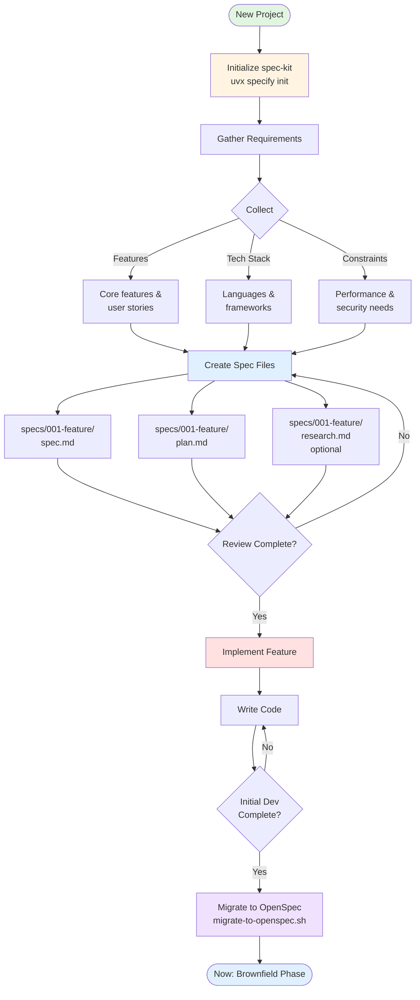
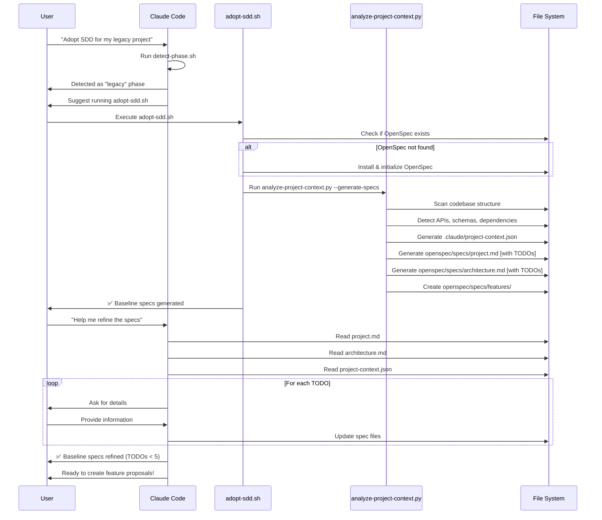
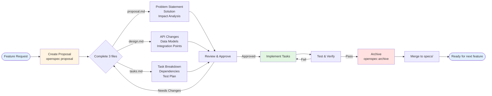
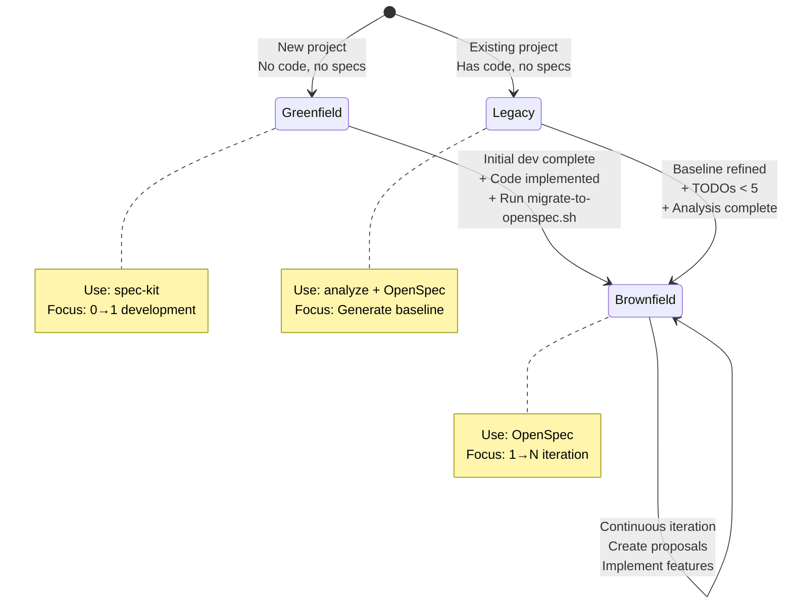
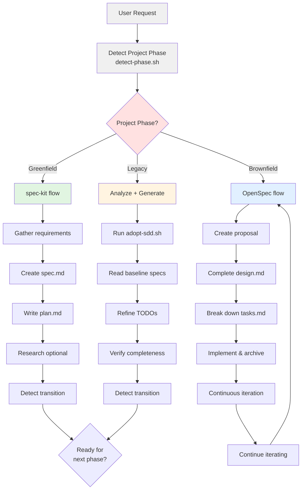

# Specification Management

Intelligent Specification-Driven Development (SDD) management that automatically selects appropriate frameworks and workflows based on project phase.

## Core Capabilities

- **Automatic Phase Detection**: Identifies Greenfield/Legacy/Brownfield project types
- **Intelligent Framework Selection**: Greenfield→spec-kit, Brownfield→OpenSpec
- **Legacy Project Adoption**: Code analysis + baseline spec auto-generation + AI-assisted refinement
- **Phase Transition Suggestions**: Automatically identifies and guides project transitions to the next phase
- **End-to-End Guidance**: Complete support from specification creation to iterative management

## Automatic Behavior (When Skill is Triggered)

When users make specification-related requests, the Skill should:

### 1. Initial Project State Detection

**Must Execute**:
```bash
bash scripts/detect-phase.sh
```

Make decisions based on detection results. Do not guess project type - must run detection command.

### 2. Take Action Based on Project Phase

#### Greenfield Scenario (No Code + No Specs)

**Trigger Condition**: Detection result is "greenfield"

**Automated Behavior**:
1. Confirm user intent (creating new project specification)
2. Collect requirement information:
   - Core features and user stories
   - Tech stack preferences
   - Technical constraints (performance, security, etc.)
   - Target user groups
3. Guide spec-kit initialization (if not initialized):
   ```bash
   # Recommended command
   uvx --from git+https://github.com/github/spec-kit.git specify init <project-name> --here --ai claude
   ```
4. Assist in completing specification files:
   - `specs/001-<feature>/spec.md` - Detailed requirement specification
   - `specs/001-<feature>/plan.md` - Technical plan
   - `specs/001-<feature>/research.md` - Technical research (if needed)

**Checkpoint**: Ensure each specification file is complete and implementable

**Greenfield Development Flow**:


#### Legacy Scenario (Has Code + No Specs)

**Trigger Condition**: Detection result is "legacy"

**Automated Behavior**:
1. Check if analysis has been run:
   - Look for `.claude/project-context.json`
   - Look for `openspec/specs/project.md`

2. If not analyzed, **proactively suggest** running adoption process:
   ```bash
   bash scripts/adopt-sdd.sh
   ```
   Note: This will automatically initialize OpenSpec and generate baseline specifications

3. After analysis completes, **must execute**:
   - Read `openspec/specs/project.md`
   - Read `openspec/specs/architecture.md`
   - Read `.claude/project-context.json` (project analysis data)

4. Guide user to refine specifications:
   - Identify all `[TODO]` markers
   - Ask for details item by item and update files
   - Ensure business context and architectural decisions are clear

5. Suggest creating feature documentation:
   ```
   "Let me help you identify core features and create documentation in openspec/specs/features/"
   ```

**Completion Standard**: Fewer than 5 TODOs in baseline specification files

**Legacy Adoption Flow**:


#### Brownfield Scenario (Has Code + Has Specs)

**Trigger Condition**: Detection result is "brownfield"

**Automated Behavior**:
1. Check if OpenSpec is initialized:
   - Look for `openspec/` directory
   - If not initialized, suggest running `openspec init`

2. Understand user requirements:
   - New feature? Modify existing feature? Bug fix?

3. Create change proposal:
   ```bash
   openspec proposal <feature-name>
   ```

4. Guide through completing proposal files:
   - `proposal.md` - Problem statement, solution, impact analysis
   - `design.md` - Technical design details
   - `tasks.md` - Implementation task breakdown

5. After implementation, guide archiving:
   ```bash
   openspec archive <feature-name>
   ```

**Brownfield Development Flow**:


### 3. Detect Phase Transition Requirements

**Check on every Skill trigger**:
```bash
bash scripts/detect-transition.sh
```

#### Phase Transition Diagram



#### Greenfield → Brownfield Transition

**Trigger Conditions**:
- `specs/` directory has complete specifications
- Has source code implementation (`src/`, `app/` etc. exist)
- User mentions keywords like "iteration", "new feature", "next step"

**Auto Suggestion**:
```
"Detected that your project has completed initial development. Recommend migrating to OpenSpec to support continuous iteration.
Run: bash scripts/migrate-to-openspec.sh"
```

#### Legacy → Brownfield Transition

**Trigger Conditions**:
- `openspec/specs/` has baseline specifications
- Baseline specs are refined (TODO < 5)
- User mentions keywords like "add feature", "modify"

**Auto Suggestion**:
```
"Baseline specifications are complete! Now you can use OpenSpec to create feature proposals.
What feature would you like to add?"
```

## Decision Flow Diagram



## Quick Adoption

One-command (recommended):

```bash
bash scripts/adopt-sdd.sh
```

This command automatically:
1. Detects project phase
2. Initializes corresponding framework (spec-kit or OpenSpec)
3. Legacy projects: Analyzes code and generates baseline specifications
4. Guides subsequent steps

Manual phase detection:

```bash
bash scripts/detect-phase.sh
```

| Detection Result | Meaning | Recommended Action |
|--------|------|---------|
| greenfield | No code, no specs | Use spec-kit → `reference/spec-kit-workflow.md` |
| brownfield | Has code, has specs | Use OpenSpec → `reference/openspec-workflow.md` |
| legacy | Has code, no specs | Run adopt-sdd.sh → `reference/legacy-adoption.md` |
| spec-kit-only | Has spec-kit, needs OpenSpec | Migrate → `reference/migration-guide.md` |

## Available Scripts

| Script | Purpose | When to Use |
|------|------|---------|
| `scripts/adopt-sdd.sh` | **One-command SDD adoption** (recommended) | Any new project or Legacy project starting SDD adoption |
| `scripts/detect-phase.sh` | Detect project phase | Must run on first Skill trigger |
| `scripts/detect-transition.sh` | Detect phase transitions | Check on every Skill trigger (automatic) |
| `scripts/analyze-project-context.py` | Analyze project and generate baseline specs | Legacy project initial adoption (called by adopt-sdd.sh) |
| `scripts/migrate-to-openspec.sh` | Migrate from spec-kit to OpenSpec | After Greenfield project completes initial development |
| `scripts/validate-spec.py` | Validate specification completeness | After spec creation, before implementation |

**Running Python scripts**: Use `uv run scripts/<script-name>.py`

**Example**:
```bash
# Recommended: one-command adoption
bash scripts/adopt-sdd.sh

# Or analyze project context separately
uv run scripts/analyze-project-context.py

# Validate specifications
uv run scripts/validate-spec.py specs/001-feature/spec.md
```

## Workflows

- **Greenfield (0→1)**: `reference/spec-kit-workflow.md`
- **Brownfield (1→N)**: `reference/openspec-workflow.md`
- **Legacy adoption**: `reference/legacy-adoption.md`
- **Migration**: `reference/migration-guide.md`
- **Initialization**: `reference/init-commands.md`

## Common Task Handling

| User Request Example | Automated Behavior | Execution Steps |
|------------|----------|---------|
| "Create spec for [feature]" | 1. Detect phase<br>2. Select framework<br>3. Guide creation | Greenfield: spec-kit full workflow<br>Brownfield: OpenSpec proposal |
| "Add new feature to existing project" | 1. Confirm OpenSpec exists<br>2. Create proposal<br>3. Complete design/tasks | `openspec proposal <name>`<br>Guide through completing three files |
| "Adopt SDD development" | 1. Detect as Legacy<br>2. Run adopt-sdd.sh<br>3. Guide spec refinement | Auto-generate baseline specs<br>AI-assisted TODO completion |
| "Prepare for iterative development" | 1. Detect transition need<br>2. Suggest migration<br>3. Execute migration script | `bash scripts/migrate-to-openspec.sh` |
| "Improve project documentation" | 1. Read existing specs<br>2. Identify TODOs<br>3. Ask and update item by item | For Legacy project baseline specs |
| "Validate spec quality" | 1. Run validation script<br>2. Report issues<br>3. Suggest improvements | `uv run scripts/validate-spec.py` |

## Quality Checkpoints

### Specification Completeness Check

**When to Trigger**: After spec creation, before implementation

**Checklist**:
- [ ] Specification files exist and are complete
- [ ] Technical solution has clear documentation
- [ ] Task breakdown is clear and testable
- [ ] Design aligns with project architecture
- [ ] Non-functional requirements considered
- [ ] Dependencies identified

**Automated Validation**:
```bash
uv run scripts/validate-spec.py <spec-file>
```

### Legacy Project Special Checks

**Baseline Specification Completeness**:
- [ ] `project.md` has TODO < 3
- [ ] `architecture.md` has TODO < 2
- [ ] At least 1 feature document in `features/`
- [ ] Business context is clear
- [ ] Architectural decisions documented

**Completion Standard**: When total TODOs < 5, can start creating feature proposals

### OpenSpec Proposal Quality

**proposal.md**:
- [ ] Problem statement is clear
- [ ] Solution is specific
- [ ] Impact analysis is complete
- [ ] Alternative solutions considered

**design.md**:
- [ ] API changes are clear
- [ ] Data models are clear
- [ ] Integration points identified

**tasks.md**:
- [ ] Task breakdown is reasonable (each 1-4 hours)
- [ ] Dependencies are correct
- [ ] Independently testable

## Prerequisites

- **Python scripts**: Requires [`uv`](https://docs.astral.sh/uv/getting-started/installation/)
- **spec-kit**: Uses `uvx` (included with uv)
- **OpenSpec**: Requires Node.js 16+ and `npm`

Install uv:
```bash
curl -LsSf https://astral.sh/uv/install.sh | sh
```

## Error Handling

If commands fail, check prerequisites:

1. **Python scripts & spec-kit**: Requires `uv`
2. **OpenSpec**: Requires Node.js 16+ and `npm`

See `reference/init-commands.md` for installation commands.

## Version History

- **v1.1.0**: Intelligence Enhancement
  - Added automatic phase detection and transition suggestions
  - Auto-generate baseline specs for Legacy projects
  - Detailed decision logic and automated behaviors
  - Complete quality checkpoints
- **v1.0.0**: Initial implementation
