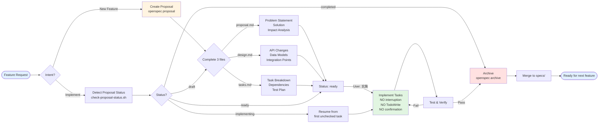

# Specification Management

Intelligent Specification-Driven Development (SDD) management that automatically selects appropriate frameworks and workflows based on project phase.

## Core Capabilities

- **Automatic Phase Detection**: Identifies Greenfield/Legacy/Brownfield project types
- **Intelligent Framework Selection**: Greenfield→spec-kit, Brownfield→OpenSpec
- **Legacy Project Adoption**: Code analysis + baseline spec auto-generation + AI-assisted refinement
- **Phase Transition Suggestions**: Automatically identifies and guides project transitions to the next phase
- **End-to-End Guidance**: Complete support from specification creation to iterative management

## Automatic Behavior (When Skill is Triggered)

When users make specification-related requests, the Skill should:

### 1. Initial Project State Detection

**Must Execute**:
```bash
bash scripts/detect-phase.sh
```

Make decisions based on detection results. Do not guess project type - must run detection command.

### 2. Take Action Based on Project Phase

#### Greenfield Scenario (No Code + No Specs)

**Trigger Condition**: Detection result is "greenfield"

**Automated Behavior**:
1. Confirm user intent (creating new project specification)
2. Collect requirement information:
   - Core features and user stories
   - Tech stack preferences
   - Technical constraints (performance, security, etc.)
   - Target user groups
3. Guide spec-kit initialization (if not initialized):
   ```bash
   # Recommended command
   uvx --from git+https://github.com/github/spec-kit.git specify init <project-name> --here --ai claude
   ```
4. Assist in completing specification files:
   - `specs/001-<feature>/spec.md` - Detailed requirement specification
   - `specs/001-<feature>/plan.md` - Technical plan
   - `specs/001-<feature>/research.md` - Technical research (if needed)

**Checkpoint**: Ensure each specification file is complete and implementable

**Greenfield Development Flow**:


#### Legacy Scenario (Has Code + No Specs)

**Trigger Condition**: Detection result is "legacy"

**CRITICAL**: When users request to create proposals/add features in a Legacy project, they MUST first adopt SDD. Do NOT attempt to create proposals directly.

**Automated Behavior**:

**Step 0: Handle proposal/feature creation requests**

If user mentions keywords like "新增提案", "创建提案", "新功能", "添加功能", "new proposal", "create proposal", "add feature":

a. **First, explain the situation clearly**:
   ```
   I noticed this project doesn't have a specification framework yet (detected as "legacy" phase).

   Before we can create feature proposals, we need to complete a one-time SDD adoption:

   1. ✅ Analyze the codebase and generate baseline specifications
   2. ✅ Refine the baseline specs (reduce TODOs to < 5)
   3. ✅ Then you can create feature proposals systematically

   This setup takes about 10-15 minutes and enables structured feature development going forward.

   Shall I start the SDD adoption process now?
   ```

b. Wait for user confirmation

c. If user agrees, proceed to Step 1 below

**Step 1-5: Standard Legacy Adoption Process**

1. Check if analysis has been run:
   - Look for `.claude/project-context.json`
   - Look for `openspec/specs/project.md`

2. If not analyzed, **proactively suggest** running adoption process:
   ```bash
   bash scripts/adopt-sdd.sh
   ```
   Note: This will automatically initialize OpenSpec and generate baseline specifications

3. After analysis completes, **must execute**:
   - Read `openspec/specs/project.md`
   - Read `openspec/specs/architecture.md`
   - Read `.claude/project-context.json` (project analysis data)

4. Guide user to refine specifications:
   - Identify all `[TODO]` markers
   - Ask for details item by item and update files
   - Ensure business context and architectural decisions are clear

5. **After refinement is complete** (TODO < 5), inform user:
   ```
   ✅ Great! Baseline specifications are now complete.

   Your project is now ready for systematic feature development!
   You can create feature proposals using: openspec proposal <feature-name>

   What feature would you like to add?
   ```

**Completion Standard**: Fewer than 5 TODOs in baseline specification files

**Legacy Adoption Flow**:


#### Brownfield Scenario (Has Code + Has Specs)

**Trigger Condition**: Detection result is "brownfield"

**Automated Behavior**:

1. Check if OpenSpec is initialized:
   - Look for `openspec/` directory
   - If not initialized, suggest running `openspec init`

2. **Detect user intent by keywords**:

   **Implementation Intent** (keywords: "实施", "开始实施", "实施这个提案", "实施提案", "执行", "开始执行", "继续实施", "implement", "start implementation", "implement this proposal", "implement the proposal", "execute", "start executing", "resume implementation"):
   - Trigger: Implementation Detection Flow (see below)

   **New Feature Intent** (keywords: "新功能", "添加功能", "创建提案", "新建提案", "new feature", "add feature", "create proposal", "new proposal"):
   - Trigger: Proposal Creation Flow (see below)

3. **Implementation Detection Flow**:

   a. Run proposal status detection:
      ```bash
      bash scripts/check-proposal-status.sh
      ```

   b. Find proposals in "ready" or "implementing" state

   c. Determine which proposal to implement:
      - If user mentions proposal name: use that specific proposal
      - If only one ready/implementing proposal exists: use that one
      - If multiple ready proposals exist: show list and ask user to choose

   d. Check the proposal's status:
      - **ready**: All files complete, no tasks started → Start from first task
      - **implementing**: Some tasks done → Resume from first unchecked task
      - **completed**: All tasks done → Suggest archiving instead
      - **draft**: Files incomplete → Ask user to complete proposal files first

   e. Execute implementation (see "Implementation Execution Pattern" below)

4. **Proposal Creation Flow**:

   a. Understand new feature requirements

   b. Create change proposal:
      ```bash
      openspec proposal <feature-name>
      ```

   c. Guide through completing proposal files:
      - `proposal.md` - Problem statement, solution, impact analysis
      - `design.md` - Technical design details
      - `tasks.md` - Implementation task breakdown

   d. After all 3 files complete, inform user:
      "Proposal is ready for implementation. Say '实施 <feature-name>' to start."

5. **After implementation completes**, guide archiving:
   ```bash
   openspec archive <feature-name>
   ```

**Implementation Execution Pattern**:

**Critical Rules** (see `reference/implementation-patterns.md` for full details):
- Do NOT create TodoWrite task list (use tasks.md directly)
- Do NOT ask "Should I start?" (user's "实施" IS the confirmation)
- Do NOT enter plan mode or ask for additional confirmation
- Execute tasks sequentially, mark [x] in real-time, continue without interruption

**Quick Reference**:
- Keywords: "实施", "开始实施", "implement", "start implementation"
- Status check: `bash scripts/check-proposal-status.sh <proposal-name>`
- Execution: Read tasks.md → Execute → Mark [x] → Next task (no interruption)
- After completion: Suggest archiving

**Details**: See `reference/implementation-patterns.md` for complete execution steps, examples, and edge cases.

**Brownfield Development Flow**:


### 3. Detect Phase Transition Requirements

**Check on every Skill trigger**:
```bash
bash scripts/detect-transition.sh
```

**Common Transitions**:
- **Greenfield → Brownfield**: Initial dev complete → Run `migrate-to-openspec.sh`
- **Legacy → Brownfield**: Baseline refined (TODO < 5) → Ready for feature proposals
- **Brownfield**: Continuous iteration (create proposals → implement → archive)

**Details**: See `reference/phase-transitions.md` for complete transition logic, detection criteria, and handling.

## Decision Flow Diagram


## Quick Adoption

One-command (recommended):

```bash
bash scripts/adopt-sdd.sh
```

This command automatically:
1. Detects project phase
2. Initializes corresponding framework (spec-kit or OpenSpec)
3. Legacy projects: Analyzes code and generates baseline specifications
4. Guides subsequent steps

Manual phase detection:

```bash
bash scripts/detect-phase.sh
```

| Detection Result | Meaning | Recommended Action |
|--------|------|---------|
| greenfield | No code, no specs | Use spec-kit → `reference/spec-kit-workflow.md` |
| brownfield | Has code, has specs | Use OpenSpec → `reference/openspec-workflow.md` |
| legacy | Has code, no specs | Run adopt-sdd.sh → `reference/legacy-adoption.md` |
| spec-kit-only | Has spec-kit, needs OpenSpec | Migrate → `reference/migration-guide.md` |

## Available Scripts

| Script | Purpose | When to Use |
|------|------|---------|
| `scripts/adopt-sdd.sh` | **One-command SDD adoption** (recommended) | Any new project or Legacy project starting SDD adoption |
| `scripts/detect-phase.sh` | Detect project phase | Must run on first Skill trigger |
| `scripts/detect-transition.sh` | Detect phase transitions | Check on every Skill trigger (automatic) |
| `scripts/analyze-project-context.py` | Analyze project and generate baseline specs | Legacy project initial adoption (called by adopt-sdd.sh) |
| `scripts/migrate-to-openspec.sh` | Migrate from spec-kit to OpenSpec | After Greenfield project completes initial development |
| `scripts/validate-spec.py` | Validate specification completeness | After spec creation, before implementation |

**Running Python scripts**: Use `uv run scripts/<script-name>.py`

**Example**:
```bash
# Recommended: one-command adoption
bash scripts/adopt-sdd.sh

# Or analyze project context separately
uv run scripts/analyze-project-context.py

# Validate specifications
uv run scripts/validate-spec.py specs/001-feature/spec.md
```

## Workflows

- **Greenfield (0→1)**: `reference/spec-kit-workflow.md`
- **Brownfield (1→N)**: `reference/openspec-workflow.md`
- **Legacy adoption**: `reference/legacy-adoption.md`
- **Migration**: `reference/migration-guide.md`
- **Initialization**: `reference/init-commands.md`

## Common Task Handling

| User Request Example | Automated Behavior | Execution Steps |
|------------|----------|---------|
| "Create spec for [feature]" | 1. Detect phase<br>2. Select framework<br>3. Guide creation | Greenfield: spec-kit full workflow<br>Brownfield: OpenSpec proposal |
| "Add new feature to existing project" | 1. Confirm OpenSpec exists<br>2. Create proposal<br>3. Complete design/tasks | `openspec proposal <name>`<br>Guide through completing three files |
| "Adopt SDD development" | 1. Detect as Legacy<br>2. Run adopt-sdd.sh<br>3. Guide spec refinement | Auto-generate baseline specs<br>AI-assisted TODO completion |
| "Prepare for iterative development" | 1. Detect transition need<br>2. Suggest migration<br>3. Execute migration script | `bash scripts/migrate-to-openspec.sh` |
| "Improve project documentation" | 1. Read existing specs<br>2. Identify TODOs<br>3. Ask and update item by item | For Legacy project baseline specs |
| "Validate spec quality" | 1. Run validation script<br>2. Report issues<br>3. Suggest improvements | `uv run scripts/validate-spec.py` |

## Quality Checkpoints

**Automated Validation**:
```bash
uv run scripts/validate-spec.py <spec-file>
```

**Key Standards**:
- Spec files complete before implementation
- Legacy projects: TODO < 5 in baseline specs
- OpenSpec proposals: All 3 files (proposal.md, design.md, tasks.md) complete
- Tasks: 1-4 hour granularity, clear dependencies

**Details**: See `reference/quality-checklist.md` for complete checklists and quality gates.

## Prerequisites

- **Python scripts**: Requires [`uv`](https://docs.astral.sh/uv/getting-started/installation/)
- **spec-kit**: Uses `uvx` (included with uv)
- **OpenSpec**: Requires Node.js 16+ and `npm`

Install uv:
```bash
curl -LsSf https://astral.sh/uv/install.sh | sh
```

## Error Handling

If commands fail, check prerequisites:

1. **Python scripts & spec-kit**: Requires `uv`
2. **OpenSpec**: Requires Node.js 16+ and `npm`

See `reference/init-commands.md` for installation commands.

## Version History

- **v1.2.0**: Enhanced Legacy Project Proposal Handling
  - Skill now automatically triggers on proposal/feature keywords (新增提案, 创建提案, new proposal, etc.)
  - Added explicit guidance for Legacy projects requesting proposals
  - Legacy projects now receive clear explanation before SDD adoption
  - Improved description to ensure skill triggers even without existing SDD setup
  - Added keywords: "proposals", "features" to plugin metadata
- **v1.1.0**: Intelligence Enhancement
  - Added automatic phase detection and transition suggestions
  - Auto-generate baseline specs for Legacy projects
  - Detailed decision logic and automated behaviors
  - Complete quality checkpoints
- **v1.0.0**: Initial implementation
