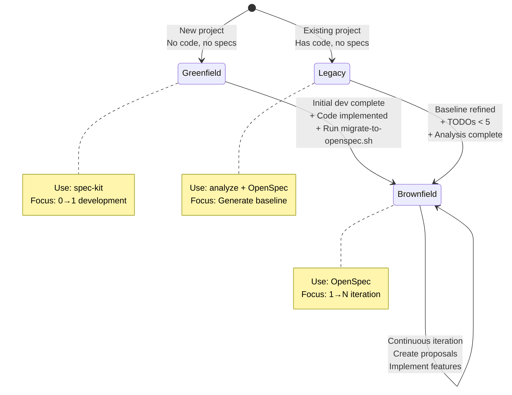

# Phase Transitions

Comprehensive guide for detecting and managing phase transitions in specification-driven development.

## Overview

The managing-specifications skill supports automatic detection of when projects should transition between phases:

- **Greenfield → Brownfield**: Initial development complete
- **Legacy → Brownfield**: Baseline specifications refined
- **Brownfield → Brownfield**: Continuous iteration

## Detection Script

**Always run** on skill trigger:
```bash
bash scripts/detect-transition.sh
```

Returns transition status and recommendations.

## Phase Transition Diagram



## Transition Details

### Greenfield → Brownfield Transition

**Trigger Conditions**:
- `specs/` directory has complete specifications
- Has source code implementation (`src/`, `app/`, etc. exist)
- User mentions keywords like "iteration", "new feature", "next step"

**Detection Logic** (in detect-transition.sh):
```bash
if [ -d "specs" ] && ([ -d "src" ] || [ -d "app" ] || [ -d "lib" ]); then
    echo "ready-for-migration"
fi
```

**Auto Suggestion**:
```
Detected that your project has completed initial development.
Recommend migrating to OpenSpec to support continuous iteration.
Run: bash scripts/migrate-to-openspec.sh
```

**Migration Steps**:
1. Run migration script: `bash scripts/migrate-to-openspec.sh`
2. Verify OpenSpec initialization
3. Review migrated specifications in `openspec/specs/`
4. Ready to create feature proposals with `openspec proposal <name>`

**What Happens During Migration**:
- spec-kit specs copied to `openspec/specs/`
- Project structure adapted for OpenSpec
- Baseline documentation established
- Change management system initialized

### Legacy → Brownfield Transition

**Trigger Conditions**:
- `openspec/specs/` has baseline specifications
- Baseline specs are refined (TODO < 5)
- User mentions keywords like "add feature", "modify"

**Detection Logic** (in detect-transition.sh):
```bash
if [ -d "openspec/specs" ] && [ -f "openspec/specs/project.md" ]; then
    TODO_COUNT=$(grep -r "\[TODO" openspec/specs/ 2>/dev/null | wc -l)
    if [ "$TODO_COUNT" -lt 5 ]; then
        echo "ready-for-iteration"
    fi
fi
```

**Auto Suggestion**:
```
Baseline specifications are complete!
Now you can use OpenSpec to create feature proposals.
What feature would you like to add?
```

**Transition Checklist**:
- [ ] `project.md` has TODO < 3
- [ ] `architecture.md` has TODO < 2
- [ ] At least 1 feature document exists
- [ ] Business context is clear
- [ ] Architectural decisions documented
- [ ] Total TODO count < 5

**Next Steps After Transition**:
1. Identify first feature to implement
2. Create proposal: `openspec proposal <feature-name>`
3. Complete proposal files (proposal.md, design.md, tasks.md)
4. Implement using the standard Brownfield workflow

### Brownfield → Brownfield (Continuous Iteration)

**Nature**: Not really a "transition" but continuous iteration within the same phase.

**Trigger Conditions**:
- Proposal completed and archived
- Ready to start next feature
- User requests new feature or modification

**Detection Logic**:
```bash
if [ -d "openspec/changes" ]; then
    ACTIVE_CHANGES=$(find openspec/changes -mindepth 1 -maxdepth 1 -type d 2>/dev/null | wc -l)

    if [ "$ACTIVE_CHANGES" -gt 0 ]; then
        # Check proposal status (ready, implementing, completed)
        echo "active-iteration" or "ready-for-implementation"
    else
        echo "stable-iteration"
    fi
fi
```

**Workflow**:
1. Complete current proposal → Archive
2. Identify next feature → Create new proposal
3. Implement → Test → Archive
4. Repeat cycle

## Transition Detection Results

| Result | Meaning | Recommended Action |
|--------|---------|-------------------|
| `ready-for-migration` | Greenfield complete | Run `migrate-to-openspec.sh` |
| `ready-for-iteration` | Legacy baseline refined | Create feature proposals |
| `ready-for-implementation` | Proposals ready | Say "实施 <proposal-name>" |
| `in-progress-implementation` | Proposals implementing | Say "继续实施 <proposal-name>" |
| `active-iteration` | Brownfield active | Continue current work |
| `stable-iteration` | Brownfield stable | Create new proposals |
| `stay-greenfield` | Still in 0→1 phase | Continue spec-kit workflow |
| `refining-baseline` | Legacy TODOs > 5 | Refine specifications |
| `needs-baseline` | No specs yet | Run `adopt-sdd.sh` |

## Handling Transition Suggestions

When detect-transition.sh suggests a transition:

### Automatic Suggestion

**Do**:
- Inform user about detected transition readiness
- Provide clear next steps
- Show the exact command to execute

**Example**:
```
✨ Detected: Your project has completed initial development

Status: ready-for-migration
Recommendation: Migrate to OpenSpec for continuous iteration

Next step: bash scripts/migrate-to-openspec.sh
```

### User Confirmation

For major transitions (Greenfield → Brownfield, Legacy → Brownfield):
- Explain what will happen
- Show migration steps
- Wait for user confirmation before executing

For minor transitions (creating new proposals):
- Suggest directly
- Proceed if user agrees

## Transition States Over Time

Typical project progression:

```
1. Start: Greenfield (0→1)
   - Create specs with spec-kit
   - Implement initial features
   - Build MVP

2. Transition: Greenfield → Brownfield
   - Trigger: Initial dev complete
   - Action: Migrate to OpenSpec
   - Duration: ~5 minutes

3. Iterate: Brownfield (1→N)
   - Create proposals
   - Implement features
   - Archive changes
   - Repeat indefinitely
```

OR

```
1. Start: Legacy (existing code)
   - Analyze codebase
   - Generate baseline specs
   - Refine documentation

2. Transition: Legacy → Brownfield
   - Trigger: TODO < 5
   - Action: Start creating proposals
   - Duration: Immediate

3. Iterate: Brownfield (1→N)
   - Same as above
```

## Common Transition Issues

### Issue: False Positive Migration Detection
**Symptom**: Script suggests migration but specs incomplete
**Fix**: Check specs completeness manually before migrating

### Issue: Stuck in Refining State
**Symptom**: TODO count not decreasing
**Fix**: Ask Claude to help refine remaining TODOs systematically

### Issue: Lost Context After Migration
**Symptom**: Can't find original spec-kit specs
**Fix**: Check `openspec/specs/` - all specs are copied there

### Issue: Multiple Transitions Detected
**Symptom**: detect-transition.sh shows multiple statuses
**Fix**: Follow priority: ready-for-implementation > ready-for-migration > refining-baseline

## Transition Verification

After any transition, verify:

1. **Phase Detection Still Works**:
   ```bash
   bash scripts/detect-phase.sh
   # Should show new phase
   ```

2. **Files in Correct Locations**:
   - Greenfield: `specs/`
   - Legacy: `openspec/specs/` (baseline)
   - Brownfield: `openspec/specs/` + `openspec/changes/`

3. **Commands Work in New Phase**:
   - Test creating a proposal: `openspec proposal test-transition`
   - Verify files are created
   - Clean up: Remove test proposal

## Related Files

- `scripts/detect-transition.sh`: Detection logic
- `scripts/migrate-to-openspec.sh`: Greenfield → Brownfield migration
- `scripts/adopt-sdd.sh`: Legacy → Brownfield preparation
- `SKILL.md`: Automatic behavior on transitions
